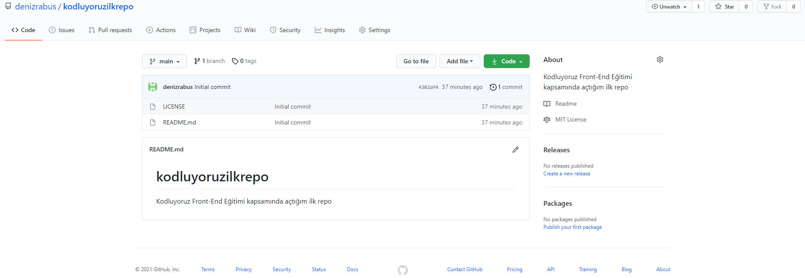

# Kodluyoruz İlk Repo

Bu repo [Kodluyoruz](https://www.kodluyoruz.org/) Front-End Eğitiminde oluşturduğum ilk repo. İçerisinde bir adet README dosyası, bir adet de index.html barındırıyor.

## Installation

Öncelikle bu projeyi clonelayın.(Buraya sizin reponuzdan aldığınız link gelecek.)

`git clone https://github.com/denizrabus/kodluyoruzilkrepo.git`

## Usage

Projeyi cloneladıktan sonra Visual Studio Code programını açınız.

Linux için;

`cd kodluyoruzilkrepo`

`code .`

## Contributing 

Pull requestler kabul edilir. Büyük değişiklikler için, lütfen önce neyi değiştirmek istediğinizi tartışmak için bir konu açınız.

## License

[MIT](https://choosealicense.com/)

